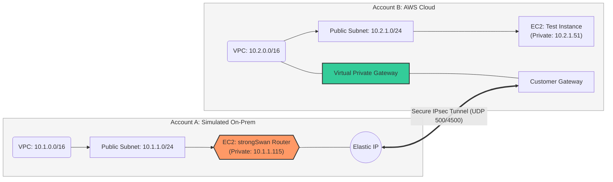

# AWS Multi-Account Hybrid Cloud Simulation
## Secure Site-to-Site VPN Architecture

### 📌 Project Overview
This project demonstrates the implementation of a secure, encrypted communication bridge between two independent AWS Accounts. By treating **Account A** as an "On-Premises Data Center" and **Account B** as a "Cloud Production Environment," I established a Site-to-Site IPsec VPN tunnel using **strongSwan** on Ubuntu.

This architecture simulates how modern enterprises connect legacy infrastructure to the AWS cloud without exposing traffic to the public internet.

### 🛠️ Tech Stack
* **Cloud Provider:** AWS (Two separate accounts)
* **Networking:** VPC, Subnets, Route Tables, Internet Gateways
* **VPN Components:** Virtual Private Gateway (VGW), Customer Gateway (CGW)
* **Software:** strongSwan (IPsec implementation)
* **Security:** IAM, Security Groups (UDP 500/4500), Source/Destination Check disabling

### 🏗️ Architecture Key Features
* **Account A (On-Prem):** `10.1.0.0/16` - Hosted a software-defined gateway on EC2.
* **Account B (Cloud):** `10.2.0.0/16` - Utilized AWS Managed VPN services.
* **Routing:** Implemented static routing to ensure cross-account traffic is directed through the `ipsec0` virtual interface.
* **Security:** Enforced "Least Privilege" via Security Groups and ensured a Data Perimeter using private IP addressing.

### 🚀 Validation
- **Tunnel Status:** Verified via `sudo ipsec status` (Security Associations: 1 up).
- **Connectivity:** Successfully executed `ping` from Account A to a private resource in Account B via the encrypted tunnel.

